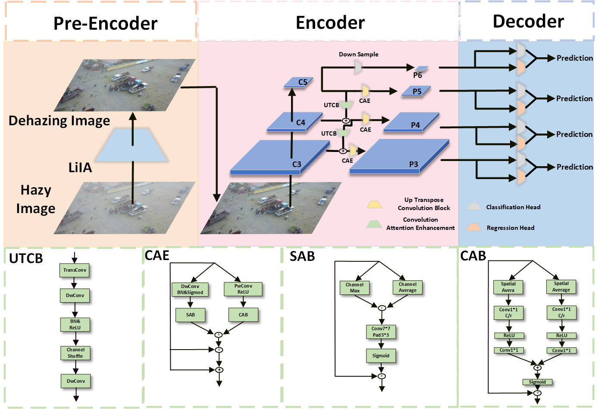

# LiDAE

## Introduction
LiDAE (Lightweight Dehazing and Attention Enhancement Network) is a plug-and-play lightweight network for image enhancement, aiming to boost drone-based object detection performance under hazy conditions. As shown in the following architecture, when integrated with a baseline detector X, the resulting X-LiDAE system operates as follows: 



## Requirements
- opencv-python~=4.11.0.86
- numpy~=2.1.2
- torch~=2.6.0+cu126
- torchvision~=0.21.0+cu126
- mmdeploy~=1.3.1
- onnx~=1.17.0
- mmengine~=0.10.7
- packaging~=25.0
- mmcv~=2.2.0
- PyYAML~=6.0.2
- prettytable~=3.16.0
- setuptools~=78.1.1
- tqdm~=4.67.1
- rich~=14.0.0
- matplotlib~=3.10.3
- six~=1.17.0
- addict~=2.4.0
- scipy~=1.15.3
- pillow~=11.0.0
- easydict~=1.13
- terminaltables~=3.1.10
- pycocotools~=2.0.8
- shapely~=2.1.0
- requests~=2.32.3

## Base Configuration
Without tweaking hyperparameters carefully, the default configuration files provided in the `configs` folder can be directly used for many detectors: 
```bash
optim_wrapper = dict(
    clip_grad=dict(max_norm=15, norm_type=2),
    optimizer=dict(lr=0.01, momentum=0.9, type='SGD', weight_decay=0.0001),
    paramwise_cfg=dict(bias_decay_mult=0.0, bias_lr_mult=2.0),
    type='OptimWrapper')
param_scheduler = [
    dict(
        begin=0, by_epoch=False, end=1000, start_factor=0.001,
        type='LinearLR'),
    dict(
        begin=0,
        by_epoch=True,
        end=12,
        gamma=0.1,
        milestones=[8,11],
        type='MultiStepLR')
]
```

## Train and Inference

Train FCOS-LiDAE
```bash
python tools/train.py configs/FCOS_LiDAE.py --work-dir work-dir_FCOS_LiDAE
```

Train ATSS-LiDAE
```bash
python tools/train.py configs/ATSS_LiDAE.py --work-dir work-dir_ATSS_LiDAE
```

Train GFL-LiDAE
```bash
python tools/train.py configs/GFL-LiDAE.py --work-dir work-dir_GFL-LiDAE
```

Test FCOS-LiDAE
```bash
python tools/train.py configs/FCOS_LiDAE.py work-dir_FCOS_LiDAE/fcos_lidae.pth --work-dir work-dir_FCOS_LiDAE
```

Test ATSS-LiDAE
```bash
python tools/train.py configs/ATSS_LiDAE.py work-dir_ATSS_LiDAE/atss_lidae.pth --work-dir work-dir_ATSS_LiDAE
```

Test GFL-LiDAE
```bash
python tools/train.py configs/GFL_LiDAE.py work-dir_GFL_LiDAE/gfl_lidae.pth --work-dir work-dir_GFL_LiDAE
```

## Results

### HazyDet
| | Test-mAP(%) ↑ | RDDTS-mAP(%) ↑ | Flops(G) ↓ | Params(M) ↓ |
|------------|:-------------:|:-------------:|:----------:|:-----------:|
| FCOS       | 46.5          | 22.6          | 188        | 31.544      |
| FCOS-LiDAE | 48.0          | 25.7          | 196        | 35.189      |
|            | 1.5           | 3.1           | 11         | 3.645       |
| ATSS       | 48.9          | 23.7          | 193        | 31.544      |
| ATSS-LiDAE | 50.2          | 26.6          | 201        | 35.281      |
|            | 1.3           | 2.9           | 8          | 3.737       |
| GFL        | 51.8          | 25.5          | 199        | 32.441      |
| GFL-LiDAE  | **52.5**      | **29.2**      | 203        | 35.226      |
|            | 0.7           | 3.7           | 4          | 2.785       |

### VisDrone2019
| | Test-mAP(%) ↑ | Flops(G) ↓ | Params(M) ↓ |
|------------|:-------------:|:----------:|:-----------:|
| FCOS       | 15.6          | 198        | 31.544      |
| FCOS-LiDAE | 16.3          | 207        | 35.189      |
|            | 0.7           | 8          | 3.645       |
| ATSS       | 17.9          | 203        | 31.544      |
| ATSS-LiDAE | 18.6          | 212        | 35.281      |
|            | 0.7           | 9          | 3.737       |
| GFL        | 19.3          | 206        | 32.441      |
| GFL-LiDAE  | **20.3**      | 215        | 35.226      |
|            | 1.0           | 9          | 2.785       |

## Model Release
| name | Params(M) | model |config|
|------------|:-------------:|:-----------:|
| FCOS-LiDAE | 35.189 | [model](https://pan.baidu.com/s/1tN0mXuef3iwzlc7FNQflOg?pwd=jwsh) |[config](https://pan.baidu.com/s/1FBuNjFwfhq8Bav7de88n4Q?pwd=ia8b) |
| ATSS-LiDAE | 35.281 | [model](https://pan.baidu.com/s/1fjThbnnGxQtCpTbrI1RCUQ?pwd=ghtr) |[config](https://pan.baidu.com/s/1lI9OUnGsVxIdrEPixD-fng?pwd=zgpi) |
| GFL-LiDAE | 35.226 | [model](https://pan.baidu.com/s/140EL6gdftme7lyb5cMW4Sw?pwd=8vvs) |[config](https://pan.baidu.com/s/1zwjn_ISBahlVzKKIBPgJig?pwd=qq1u)|

## Acknowledgement
Our LLMDet is heavily inspired by many outstanding prior works, including
- [MMDetection](https://github.com/open-mmlab/mmdetection)
- [WtConv](https://github.com/BGU-CS-VIL/WTConv)
- [IA-YOLO](https://github.com/Saleh-Ibtasham/IA-YOLO_reproduce)
- [SR-TOD](https://github.com/Hiyuur/SR-TOD)
- [CBAM](https://github.com/OpenGVLab/all-seeing)
- [HazyDet](https://github.com/GrokCV/HazyDet)

Thank the authors of above projects for open-sourcing their assets!

## Licence

## Citation